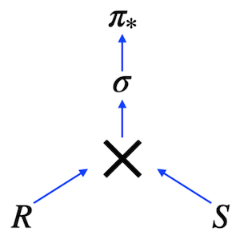

# Day 02 - Piscine SQL: Deep diving into JOINs in SQL

## Обзор проекта

Этот день посвящен глубокому изучению операций `JOIN` в SQL. В рамках проекта решены 10 практических задач, демонстрирующих использование различных типов соединений, включая `LEFT JOIN`, `RIGHT JOIN`, `FULL JOIN`, а также работу с `CTE` (Common Table Expressions).

---

## Теория: Реляционная алгебра и JOIN



### Основные концепции:

* **Реляционная алгебра** — математическая основа реляционных баз данных
* **CROSS JOIN** (декартово произведение) — базовая операция для других типов соединений
* **Другие типы соединений**:

  * Natural Join
  * Theta Join
  * Semi Join
  * Anti Join
* **Левосторонние / правосторонние соединения** (`LEFT`, `RIGHT`, `FULL JOIN`)

### Псевдокод операции соединения без индексов:

```python
FOR r in R LOOP
    FOR s in S LOOP
        if r.id = s.r_id then add(r, s)
        ...
    END;
END;
```

---

## База данных

### Схема базы данных


### Описание таблиц

#### `pizzeria`

* `id` — первичный ключ
* `name` — название пиццерии
* `rating` — средний рейтинг (0–5 баллов)

#### `person`

* `id` — первичный ключ
* `name` — имя человека
* `age` — возраст
* `gender` — пол
* `address` — адрес

#### `menu`

* `id` — первичный ключ
* `pizzeria_id` — внешний ключ к `pizzeria`
* `pizza_name` — название пиццы
* `price` — цена

#### `person_visits`

* `id` — первичный ключ
* `person_id` — внешний ключ к `person`
* `pizzeria_id` — внешний ключ к `pizzeria`
* `visit_date` — дата посещения

#### `person_order`

* `id` — первичный ключ
* `person_id` — внешний ключ к `person`
* `menu_id` — внешний ключ к `menu`
* `order_date` — дата заказа

---

## Ключевые особенности

* 10 упражнений на освоение различных типов `JOIN`
* Работа с реляционной моделью данных на примере пиццерий
* Использование стандарта **ANSI SQL**
* Применение `CTE` (Common Table Expressions)
* Решение задач с ограничениями на использование определенных конструкций

---

## Задачи

### Exercise 00 - Move to the LEFT, move to the RIGHT

**Задание:**
Вернуть список пиццерий (название и рейтинг), которые никто не посещал.
**Ограничения:**
Запрещено использовать `NOT IN`, `IN`, `NOT EXISTS`, `EXISTS`, `UNION`, `EXCEPT`, `INTERSECT`.

---

### Exercise 01 - Find data gaps

**Задание:**
Вернуть пропущенные дни с 1 по 10 января 2022 (включительно) для посещений людьми с `id` 1 или 2 (дни, в которые ни один из них не посещал пиццерии).
Отсортировать по дате.
**Разрешенные конструкции:**
`generate_series(...)`
**Ограничения:**
Запрещено использовать `NOT IN`, `IN`, `NOT EXISTS`, `EXISTS`, `UNION`, `EXCEPT`, `INTERSECT`.

**Пример вывода:**

```
missing_date
2022-01-03
...
```

---

### Exercise 02 - FULL means 'completely filled'

**Задание:**
Вернуть полный список имён людей и пиццерий за период с 1 по 3 января 2022, включая те, которые не посещались (или люди, которые не посещали).
Заменить `NULL` на `'-'`.
Отсортировать по `person_name`, `visit_date`, `pizzeria_name`.
**Ограничения:**
Запрещено использовать `NOT IN`, `IN`, `NOT EXISTS`, `EXISTS`, `UNION`, `EXCEPT`, `INTERSECT`.

**Пример вывода:**

```
person_name  visit_date  pizzeria_name
-            null        DinoPizza
Andrey       2022-01-01  Dominos
...
```

---

### Exercise 03 - Reformat to CTE

**Задание:**
Переписать решение Exercise 01 с использованием `CTE`.
**Разрешенные конструкции:**
`generate_series(...)`
**Ограничения:**
Запрещено использовать `NOT IN`, `IN`, `NOT EXISTS`, `EXISTS`, `UNION`, `EXCEPT`, `INTERSECT`.

---

### Exercise 04 - Find favourite pizzas

**Задание:**
Вернуть информацию обо всех возможных названиях пицц (с грибами или пепперони) и соответствующих пиццериях с ценами.
Отсортировать по названию пиццы и пиццерии.

**Пример вывода:**

```
pizza_name       pizzeria_name  price
mushroom pizza   Dominos        1100
...
```

---

### Exercise 05 - Investigate Person Data

**Задание:**
Вернуть имена всех женщин старше 25 лет, отсортированные по имени.

**Пример вывода:**

```
name
Elvira
...
```

---

### Exercise 06 - Favourite pizzas for Denis and Anna

**Задание:**
Вернуть названия пицц (и соответствующих пиццерий), которые заказывали Denis или Anna.
Отсортировать по названию пиццы и пиццерии.

**Пример вывода:**

```
pizza_name     pizzeria_name
cheese pizza   Best Pizza
...
```

---

### Exercise 07 - Cheapest pizzeria for Dmitriy

**Задание:**
Найти название пиццерии, которую посетил Dmitriy 8 января 2022 и где он мог поесть пиццу дешевле 800 рублей.

---

### Exercise 08 - Continuing to research data

**Задание:**
Найти имена всех мужчин из Москвы или Самары, которые заказывали пиццу с пепперони или грибами (или обе).
Отсортировать по именам в убывающем порядке.

**Пример вывода:**

```
name
Dmitriy
...
```

---

### Exercise 09 - Who loves cheese and pepperoni?

**Задание:**
Найти имена всех женщин, которые заказывали и пепперони, и сырную пиццу (в любое время и в любых пиццериях).
Отсортировать по имени.

**Пример вывода:**

```
name
Anna
...
```

---

### Exercise 10 - Find persons from one city

**Задание:**
Найти пары людей, проживающих по одному адресу.
Отсортировать по имени первого человека, имени второго и общему адресу.

**Пример вывода:**

```
person_name1  person_name2  common_address
Andrey        Anna          Moscow
...
```

---

## Технологии

* **PostgreSQL** — система управления реляционными базами данных
* **ANSI SQL** — стандартизированный язык запросов
* **psql / pgAdmin** — инструменты для работы с PostgreSQL

---

## Как использовать

1. Установите PostgreSQL
2. Создайте базу данных и выполните [script](materials/model.sql) инициализации
3. Для каждого упражнения выполните соответствующий `.sql`-файл
4. Результаты можно просмотреть в psql или pgAdmin
