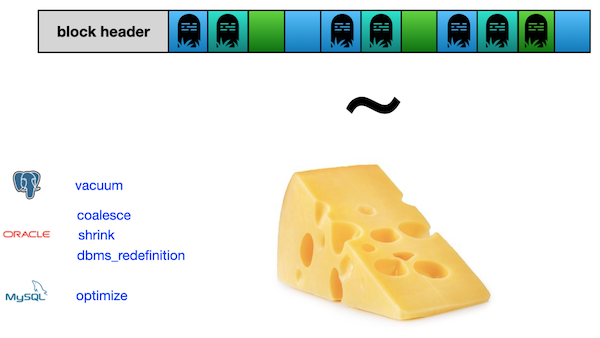

# Day 03 — Piscine SQL: Continuing to JOIN and make change in data

## Обзор проекта

Этот день посвящен углубленной работе с операциями `JOIN` и изменению данных с помощью DML (Data Manipulation Language).
В рамках проекта решены **13 практических задач**, демонстрирующих использование различных типов соединений, а также операции **вставки, обновления и удаления данных**.

---

## Теория: Реляционная алгебра и DML


### Основные концепции

* **Реляционная теория** — математическая основа реляционных баз данных
* Операции DML имеют математические аналоги:

  * `INSERT` = объединение множеств (`UNION`)
  * `DELETE` = разность множеств (`EXCEPT`)
  * `UPDATE` = удаление + вставка (операция "Tombstone")

### Пример математической записи операций:

```sql
-- INSERT
rel := rel UNION RELATION {TUPLE {A: 4, B: 7, C: 'Hello'}};

-- DELETE
rel := rel WHERE NOT (A = 1);

-- UPDATE
rel := (rel MINUS T1) UNION T4;
```

### Особенности реализации:

* Операция `UPDATE` физически выполняется как `DELETE` + `INSERT`
* **"Tombstone"** — метка удалённых/изменённых строк
* Большое количество tombstone'ов снижает производительность (TPS)



---

## База данных

### Схема базы данных


### Описание таблиц

**pizzeria**

* `id` — первичный ключ
* `name` — название пиццерии
* `rating` — средний рейтинг (0–5 баллов)

**person**

* `id` — первичный ключ
* `name` — имя человека
* `age` — возраст
* `gender` — пол
* `address` — адрес

**menu**

* `id` — первичный ключ
* `pizzeria_id` — внешний ключ к `pizzeria`
* `pizza_name` — название пиццы
* `price` — цена

**person\_visits**

* `id` — первичный ключ
* `person_id` — внешний ключ к `person`
* `pizzeria_id` — внешний ключ к `pizzeria`
* `visit_date` — дата посещения

**person\_order**

* `id` — первичный ключ
* `person_id` — внешний ключ к `person`
* `menu_id` — внешний ключ к `menu`
* `order_date` — дата заказа

---

## Ключевые особенности

* 13 упражнений на освоение `JOIN` и DML операций
* Работа с реляционной моделью данных на примере пиццерий
* Использование стандарта **ANSI SQL**
* Применение **динамических идентификаторов**
* Массовые операции вставки данных

> **Важно:** Некоторые задачи изменяют данные — рекомендуется делать бэкап

---

## Задачи

### Exercise 00 — Let's find appropriate prices for Kate

**Задание:**
Вернуть список названий пицц, цен, пиццерий и дат посещений для **Kate** с ценами от 800 до 1000 рублей.
Отсортировать по названию пиццы, цене и пиццерии.

| pizza\_name  | price | pizzeria\_name | visit\_date |
| ------------ | ----- | -------------- | ----------- |
| cheese pizza | 950   | DinoPizza      | 2022-01-04  |
| ...          | ...   | ...            | ...         |

---

### Exercise 01 — Let's find forgotten menus

**Задание:**
Найти ID меню, которые никто не заказывал.
Отсортировать по ID.
**Ограничения:** Запрещены любые типы JOIN.

| menu\_id |
| -------- |
| 5        |
| ...      |

---

### Exercise 02 — Let's find forgotten pizza and pizzerias

**Задание:**
Вернуть названия пицц, их цены и пиццерии, которые никто не заказывал.
Отсортировать по названию пиццы и цене.

| pizza\_name  | price | pizzeria\_name |
| ------------ | ----- | -------------- |
| cheese pizza | 700   | Papa Johns     |
| ...          | ...   | ...            |

---

### Exercise 03 — Let's compare visits

**Задание:**
Найти пиццерии, которые чаще посещались женщинами или мужчинами.
Сохранить дубликаты.
Отсортировать по названию.

| pizzeria\_name |
| -------------- |
| Best Pizza     |
| ...            |

---

### Exercise 04 — Let's compare orders

**Задание:**
Найти пиццерии, которые заказывали **только женщины** или **только мужчины**.
Объединить результаты **без дубликатов**.
Отсортировать по названию.

| pizzeria\_name |
| -------------- |
| Papa Johns     |
| ...            |

---

### Exercise 05 — Visited but did not make any order

**Задание:**
Найти пиццерии, которые **Andrey** посетил, но не сделал заказ.
Отсортировать по названию.

| pizzeria\_name |
| -------------- |
| Pizza Hut      |
| ...            |

---

### Exercise 06 — Find price-similarity pizzas

**Задание:**
Найти одинаковые названия пицц с одинаковой ценой в разных пиццериях.
Отсортировать по названию пиццы.

| pizza\_name  | pizzeria\_name\_1 | pizzeria\_name\_2 | price |
| ------------ | ----------------- | ----------------- | ----- |
| cheese pizza | Best Pizza        | Papa Johns        | 700   |
| ...          | ...               | ...               | ...   |

---

### Exercise 07 — Let's cook a new type of pizza

**Задание:**
Добавить новую пиццу **"Greek pizza"** (`id=19`) ценой **800 рублей** в пиццерию **"Dominos"**.

> **Предупреждение:** Изменяет данные

---

### Exercise 08 — Let's cook a new type of pizza with more dynamics

**Задание:**
Добавить пиццу **"Sicilian pizza"** с **динамическим ID** (`max_id + 1`), ценой **900 рублей** в **Dominos**.
**Ограничения:** Запрещено использовать **явные ID**.

> **Предупреждение:** Изменяет данные

---

### Exercise 09 — New pizza means new visits

**Задание:**
Добавить посещения **Denis** и **Irina** в **Dominos** **24 февраля 2022**.
**Ограничения:** Запрещено использовать **явные ID**.

> **Предупреждение:** Изменяет данные

---

### Exercise 10 — New visits means new orders

**Задание:**
Добавить заказы **Denis** и **Irina** на **"Sicilian Pizza"** **24 февраля 2022**.
**Ограничения:** Запрещено использовать **явные ID**.

> **Предупреждение:** Изменяет данные

---

### Exercise 11 — "Improve" a price for clients

**Задание:**
Снизить цену **"Greek Pizza"** на **10%**.

> **Предупреждение:** Изменяет данные

---

### Exercise 12 — New orders are coming!

**Задание:**
Добавить заказы **всех людей** на **"Greek pizza"** **25 февраля 2022**.
**Разрешенные конструкции:** `generate_series`, `INSERT-SELECT`
**Ограничения:**

* Запрещены **явные ID**
* Запрещены **оконные функции**
* Запрещены **атомарные INSERT**

> **Предупреждение:** Изменяет данные

---

### Exercise 13 — Money back to our customers

**Задание:**
Удалить заказы от **25 февраля 2022** на **"Greek Pizza"**, затем удалить **"Greek Pizza"** из меню.

> **Предупреждение:** Изменяет данные

---

## Технологии

* **PostgreSQL** — система управления реляционными базами данных
* **ANSI SQL** — стандартизированный язык запросов
* **psql / pgAdmin** — инструменты для работы с PostgreSQL

---

## Как использовать

1. Установите **PostgreSQL**
2. Создайте базу данных и выполните **[script](materials/model.sql) инициализации**
3. Для упражнений с изменением данных рекомендуется **создать бэкап**
4. Для каждого упражнения выполните соответствующий `.sql`-файл
5. Результаты можно просматривать в `psql` или **pgAdmin**

> **Важно:** Упражнения `07–13` изменяют данные
> Для восстановления исходного состояния:
>
> * Выполните скрипт инициализации
> * Последовательно выполните скрипты упражнений `07–13`
