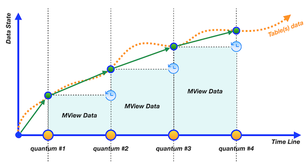

# Day 04 - Piscine SQL: Snapshots, virtual tables… What is going on?

## Обзор проекта

Этот день посвящен работе с виртуальными представлениями (Views) и материализованными представлениями (Materialized Views) в PostgreSQL. В рамках проекта решены 8 практических задач, демонстрирующих создание, использование и управление представлениями.

---

## Теория: Виртуальные и материализованные представления


### Основные концепции

#### Виртуальные представления (Views)

* Не хранят данные физически
* Представляют собой "окно" в базовые таблицы
* Всегда возвращают актуальные данные
* Могут использоваться для INSERT/UPDATE/DELETE (с ограничениями)
* Поддерживают триггеры `INSTEAD OF`

#### Материализованные представления (Materialized Views)

* Физически хранят данные на диске
* Требуют явного обновления (`REFRESH`)
* Работают быстрее для сложных запросов
* Могут иметь собственные индексы
* Доступны только для чтения

---

### Архитектура ANSI/SPARK

* **Внешний уровень** — интерфейс для пользователей/приложений
* **Концептуальный уровень** — логическая модель данных
* **Внутренний уровень** — физическое хранение данных

---

### Ключевые отличия
* *Виртуальные представления **всегда возвращают актуальные данные***


* *Материализованные представления **требуют обновления***


---

## База данных

### Схема базы данных


### Описание таблиц

#### pizzeria

* `id` — первичный ключ
* `name` — название пиццерии
* `rating` — средний рейтинг (0-5 баллов)

#### person

* `id` — первичный ключ
* `name` — имя человека
* `age` — возраст
* `gender` — пол
* `address` — адрес

#### menu

* `id` — первичный ключ
* `pizzeria_id` — внешний ключ к `pizzeria`
* `pizza_name` — название пиццы
* `price` — цена

#### person\_visits

* `id` — первичный ключ
* `person_id` — внешний ключ к `person`
* `pizzeria_id` — внешний ключ к `pizzeria`
* `visit_date` — дата посещения

#### person\_order

* `id` — первичный ключ
* `person_id` — внешний ключ к `person`
* `menu_id` — внешний ключ к `menu`
* `order_date` — дата заказа

---

## Ключевые особенности

* 8 упражнений на освоение виртуальных и материализованных представлений
* Работа с реляционной моделью данных на примере пиццерий
* Использование ANSI SQL стандарта
* Применение операций над множествами
* Динамическая генерация дат
* **Важно:** Состояние базы данных сохраняется с предыдущих дней (Day03)

---

## Структура проекта

```
src/
├── ex00
│   └── day04_ex00.sql
├── ex01
│   └── day04_ex01.sql
├── ex02
│   └── day04_ex02.sql
├── ex03
│   └── day04_ex03.sql
├── ex04
│   └── day04_ex04.sql
├── ex05
│   └── day04_ex05.sql
├── ex06
│   └── day04_ex06.sql
├── ex07
│   └── day04_ex07.sql
└── ex08
    └── day04_ex08.sql
```

---

## Задачи

### Exercise 00 — Let's create separated views for persons

**Задание:**

Создать два представления:

* `v_persons_female` — только женщины
* `v_persons_male` — только мужчины

Атрибуты представлений должны соответствовать таблице `person`.

---

### Exercise 01 — From parts to common view

**Задание:**

Используя представления из Exercise 00, вернуть объединенный список имен женщин и мужчин. Отсортировать по имени.

**Пример результата:**

| name   |
| ------ |
| Andrey |
| Anna   |
| ...    |

---

### Exercise 02 — "Store" generated dates in one place

**Задание:**

Создать представление `v_generated_dates`, содержащее даты с 1 по 31 января 2022. Отсортировать по дате.

**Пример результата:**

| generated\_date |
| --------------- |
| 2022-01-01      |
| 2022-01-02      |
| ...             |

---

### Exercise 03 — Find missing visit days with Database View

**Задание:**

Используя `v_generated_dates`, найти дни января 2022, в которые никто не посещал пиццерии. Отсортировать по дате.

**Пример результата:**

| missing\_date |
| ------------- |
| 2022-01-11    |
| 2022-01-12    |
| ...           |

---

### Exercise 04 — Let's find something from Set Theory

**Задание:**

Создать представление `v_symmetric_union`, вычисляющее симметрическую разность:

```
(R - S) ∪ (S - R)
```

где:

* `R` = `person_id` из `person_visits` за 2 января 2022
* `S` = `person_id` из `person_visits` за 6 января 2022

Отсортировать по `person_id`.

---

### Exercise 05 — Let's calculate a discount price for each person

**Задание:**

Создать представление `v_price_with_discount`, возвращающее:

* Имя человека
* Название пиццы
* Цену
* Цену со скидкой 10% (округлить до целого)

Отсортировать по имени человека и названию пиццы.

**Пример результата:**

| name   | pizza\_name  | price | discount\_price |
| ------ | ------------ | ----- | --------------- |
| Andrey | cheese pizza | 800   | 720             |
| ...    | ...          | ...   | ...             |

---

### Exercise 06 — Materialization from virtualization

**Задание:**

Создать **материализованное** представление `mv_dmitriy_visits_and_eats`, содержащее название пиццерии, которую Dmitriy посетил **8 января 2022** и где мог поесть пиццу дешевле **800 рублей**.

---

### Exercise 07 — Refresh our state

**Задание:**

1. Добавить новое посещение Dmitriy в другую пиццерию (с ценой < 800)
2. Обновить материализованное представление `mv_dmitriy_visits_and_eats`

**Ограничение:**
Запрещено использовать **явные ID**.

---

### Exercise 08 — Just clear our database

**Задание:**

Удалить **все созданные** представления и материализованные представления.

---

## Технологии

* **PostgreSQL** — система управления реляционными базами данных
* **ANSI SQL** — стандартизированный язык запросов
* **psql/pgAdmin** — инструменты для работы с PostgreSQL

---

## Как использовать

1. Установите PostgreSQL
2. Восстановите БД из [script](materials/model.sql) (с учетом изменений Day03)
3. Для каждого упражнения выполните соответствующий SQL-файл
4. Результаты можно просмотреть в `psql` или `pgAdmin`

**Важно:**
Для упражнений 06–07 состояние базы данных должно соответствовать концу Day03.
