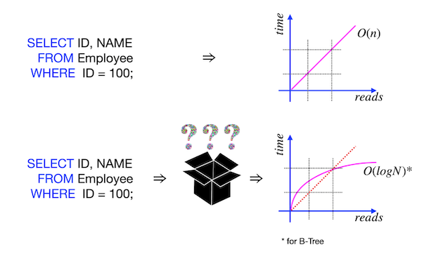

# Day 05 - Piscine SQL: I improved my SQL Query! Please, provide proof!

## Обзор проекта

Этот день посвящен созданию и оптимизации индексов в PostgreSQL. В рамках проекта решены 7 практических задач, демонстрирующих различные типы индексов и их влияние на производительность запросов.

---

## Теория: Индексы в PostgreSQL


**Индексы** — структуры данных, ускоряющие поиск.

**B-Tree** — самый распространенный тип индекса.

### Последовательное сканирование (Sequential Scan):

* Поиск по всем строкам таблицы
* Время поиска: `O(n)`
* Эффективно для маленьких таблиц

### Сканирование по индексу (Index Scan):

* Поиск через структуру индекса
* Время поиска: `O(log n)`
* Эффективно для больших таблиц

### Почему индекс может не использоваться:

* Для маленьких таблиц последовательное сканирование быстрее
* Неправильный тип индекса для запроса
* Индекс не покрывает все условия запроса
* Статистика устарела

---

* *Сравнение времени поиска: **последовательное vs индексное***


* *Точка перехода: **когда индексное сканирование становится эффективнее***


---

## Команда анализа

```sql
EXPLAIN ANALYZE
SELECT ... 
-- Показывает план выполнения и время
```

---

## База данных

### Схема базы данных


### Описание таблиц

#### pizzeria

* `id` — первичный ключ
* `name` — название пиццерии
* `rating` — средний рейтинг (0-5 баллов)

#### person

* `id` — первичный ключ
* `name` — имя человека
* `age` — возраст
* `gender` — пол
* `address` — адрес

#### menu

* `id` — первичный ключ
* `pizzeria_id` — внешний ключ к `pizzeria`
* `pizza_name` — название пиццы
* `price` — цена

#### person\_visits

* `id` — первичный ключ
* `person_id` — внешний ключ к `person`
* `pizzeria_id` — внешний ключ к `pizzeria`
* `visit_date` — дата посещения

#### person\_order

* `id` — первичный ключ
* `person_id` — внешний ключ к `person`
* `menu_id` — внешний ключ к `menu`
* `order_date` — дата заказа

---

## Ключевые особенности

* 6 упражнений на создание и оптимизацию индексов
* Работа с различными типами индексов: B-Tree, функциональные, многоколоночные, уникальные
* Анализ производительности с помощью `EXPLAIN ANALYZE`
* Состояние базы данных сохраняется с предыдущих дней

---

## Задачи

### Exercise 00 - Let's create indexes for every foreign key

**Задание**:
Создать B-Tree индексы для всех внешних ключей по шаблону именования:
`idx_{table_name}_{column_name}`

---

### Exercise 01 - How to see that index works?

**Задание**:

* Написать запрос, возвращающий названия пицц и соответствующих пиццерий
* Доказать работу индексов с помощью `EXPLAIN ANALYZE`

**Пример результата**:

| pizza\_name  | pizzeria\_name |
| ------------ | -------------- |
| cheese pizza | Pizza Hut      |
| ...          | ...            |

---

### Exercise 02 - Formula is in the index. Is it Ok?

**Задание**:
Создать функциональный B-Tree индекс `idx_person_name` для столбца `name` таблицы `person`, преобразующий имена в верхний регистр.
Предоставить доказательство работы индекса.

---

### Exercise 03 - Multicolumn index for our goals

**Задание**:
Создать многоколоночный индекс `idx_person_order_multi` для оптимизации запроса:

```sql
SELECT person_id, menu_id, order_date
FROM person_order
WHERE person_id = 8 AND menu_id = 19;
```

Предоставить доказательство работы индекса с **Index Only Scan**.

---

### Exercise 04 - Uniqueness for data

**Задание**:
Создать уникальный индекс `idx_menu_unique` для комбинации `pizzeria_id` и `pizza_name` в таблице `menu`.
Предоставить доказательство работы индекса.

---

### Exercise 05 - Partial uniqueness for data

**Задание**:
Создать частично уникальный индекс `idx_person_order_order_date` для `person_id` и `menu_id` с условием `order_date = '2022-01-01'`.
Предоставить доказательство работы индекса с **Index Only Scan**.

---

### Exercise 06 - Let's make performance improvement

**Задание**:
Создать индекс `idx_1`, улучшающий производительность запроса:

```sql
SELECT
    m.pizza_name AS pizza_name,
    max(rating) OVER (
        PARTITION BY rating 
        ORDER BY rating 
        ROWS BETWEEN UNBOUNDED PRECEDING AND UNBOUNDED FOLLOWING
    ) AS k
FROM menu m
INNER JOIN pizzeria pz ON m.pizzeria_id = pz.id
ORDER BY 1, 2;
```

Предоставить доказательство улучшения времени выполнения.

---

## Технологии

* **PostgreSQL** — система управления реляционными базами данных
* **ANSI SQL** — стандартизированный язык запросов
* **psql / pgAdmin** — инструменты для работы с PostgreSQL

---

## Как использовать

1. Установите PostgreSQL
2. Восстановите БД из [script](materials/model.sql) (с учетом изменений предыдущих дней)
3. Для каждого упражнения выполните соответствующий SQL-файл
4. Для анализа производительности используйте:

```sql
EXPLAIN ANALYZE
-- Ваш запрос
```

### Важно: Для объективного сравнения производительности:

* Очищайте кеш между тестами:

  ```sql
  DISCARD PLANS;
  ```

* Используйте последовательность:

  1. Запрос без индекса
  2. Создание индекса
  3. Запрос с индексом
