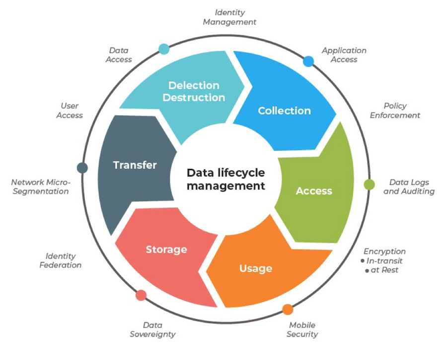

# Day 07 - Piscine SQL: Aggregated data is more informative, isn't it?

## Обзор проекта

Этот день посвящен анализу данных с помощью агрегирующих функций и группировок в SQL. В рамках проекта решены 9 практических задач, демонстрирующих использование операций OLAP (Online Analytical Processing) для извлечения полезной информации из данных.

---

## Теория: Аналитическая обработка данных


### Основные концепции:

* **Кривая полезности данных** — показывает, как ценность данных изменяется со временем

#### OLTP (Online Transaction Processing):

* Обработка транзакций в реальном времени
* Фокус на детализированных данных
* Оптимизирована для записи

#### OLAP (Online Analytical Processing):

* Аналитическая обработка данных
* Фокус на агрегированных данных
* Оптимизирована для чтения

### Управление жизненным циклом данных:

* **TTL (Time-To-Live)** — время жизни данных
* Политики хранения данных
* Архивация и удаление устаревших данных

---

## Паттерн LakeHouse

```text
LakeHouse = DataLake (сырые данные) + DataWarehouse (агрегированные данные)
```

* *Современный подход к хранению и анализу данных*


---

## База данных

### Схема базы данных


### Описание таблиц

#### `pizzeria`

* `id` — первичный ключ
* `name` — название пиццерии
* `rating` — средний рейтинг (0–5 баллов)

#### `person`

* `id` — первичный ключ
* `name` — имя человека
* `age` — возраст
* `gender` — пол
* `address` — адрес

#### `menu`

* `id` — первичный ключ
* `pizzeria_id` — внешний ключ к `pizzeria`
* `pizza_name` — название пиццы
* `price` — цена

#### `person_visits`

* `id` — первичный ключ
* `person_id` — внешний ключ к `person`
* `pizzeria_id` — внешний ключ к `pizzeria`
* `visit_date` — дата посещения

#### `person_order`

* `id` — первичный ключ
* `person_id` — внешний ключ к `person`
* `menu_id` — внешний ключ к `menu`
* `order_date` — дата заказа

#### `person_discounts` (из Day 06)

* `id` — первичный ключ
* `person_id` — внешний ключ к `person`
* `pizzeria_id` — внешний ключ к `pizzeria`
* `discount` — размер скидки в процентах

---

## Ключевые особенности

* 9 упражнений на агрегацию данных и аналитические запросы
* Работа с функциями: `COUNT`, `AVG`, `MAX`, `MIN`, `ROUND`
* Группировка данных с помощью `GROUP BY`
* Фильтрация групп с помощью `HAVING`
* Объединение результатов из разных таблиц
* **Важно**: состояние базы данных сохраняется с предыдущих дней

---

## Задачи

### Exercise 00 - Simple aggregated information

**Задание:**
Вернуть идентификаторы людей и количество их посещений пиццерий.
Отсортировать по количеству посещений (убывание) и `person_id` (возрастание).

| person\_id | count\_of\_visits |
| ---------- | ----------------- |
| 9          | 4                 |
| 4          | 3                 |
| ...        | ...               |

---

### Exercise 01 - Let's see real names

**Задание:**
Модифицировать запрос из Exercise 00: вернуть имена (не ID) 4 людей с наибольшим количеством посещений.
Отсортировать по имени.

| name    | count\_of\_visits |
| ------- | ----------------- |
| Dmitriy | 4                 |
| Denis   | 3                 |
| ...     | ...               |

---

### Exercise 02 - Restaurants statistics

**Задание:**
Вернуть топ-3 пиццерий по количеству заказов и посещений.
Добавить столбец `action_type` (`'order'` или `'visit'`).
Отсортировать по `action_type` (возрастание) и количеству (убывание).

| name    | count | action\_type |
| ------- | ----- | ------------ |
| Dominos | 6     | order        |
| Dominos | 7     | visit        |
| ...     | ...   | ...          |

---

### Exercise 03 - Restaurants statistics #2

**Задание:**
Объединить статистику по заказам и посещениям для каждой пиццерии.
Вернуть суммарное количество действий.
Отсортировать по `total_count` (убывание) и `name` (возрастание).

| name      | total\_count |
| --------- | ------------ |
| Dominos   | 13           |
| DinoPizza | 9            |
| ...       | ...          |

---

### Exercise 04 - Clause for groups

**Задание:**
Вернуть имена людей и количество их посещений, если они посещали пиццерии более 3 раз.
**Ограничения:** запрещено использовать `WHERE`.

| name    | count\_of\_visits |
| ------- | ----------------- |
| Dmitriy | 4                 |

---

### Exercise 05 - Person's uniqueness

**Задание:**
Вернуть уникальные имена людей, которые делали заказы.
Отсортировать по имени.
**Ограничения:** запрещены `GROUP BY` и операции над множествами.

| name   |
| ------ |
| Andrey |
| Anna   |
| ...    |

---

### Exercise 06 - Restaurant metrics

**Задание:**
Для каждой пиццерии вернуть:

* Количество заказов
* Среднюю цену (округлить до 2 знаков)
* Максимальную цену
* Минимальную цену

Отсортировать по названию пиццерии.

| name       | count\_of\_orders | average\_price | max\_price | min\_price |
| ---------- | ----------------- | -------------- | ---------- | ---------- |
| Best Pizza | 5                 | 780            | 850        | 700        |
| ...        | ...               | ...            | ...        | ...        |

---

### Exercise 07 - Average global rating

**Задание:**
Вернуть средний рейтинг всех пиццерий (глобальный рейтинг).
Округлить до 4 знаков.

| global\_rating |
| -------------- |
| 3.2500         |

---

### Exercise 08 - Find pizzeria's restaurant locations

**Задание:**
Для каждого адреса вернуть:

* Адрес
* Название пиццерии
* Количество заказов от людей из этого адреса

Отсортировать по адресу и названию пиццерии.

| address | name       | count\_of\_orders |
| ------- | ---------- | ----------------- |
| Kazan   | Best Pizza | 4                 |
| ...     | ...        | ...               |

---

### Exercise 09 - Explicit type transformation

**Задание:**
Для каждого адреса вычислить:

* Формула: `Макс.возраст - (Мин.возраст / Макс.возраст)`
* Средний возраст
* Сравнение: если формула > среднего, то `true`, иначе `false`

Отсортировать по адресу.

| address | formula | average | comparison |
| ------- | ------- | ------- | ---------- |
| Kazan   | 44.71   | 30.33   | true       |
| ...     | ...     | ...     | ...        |

---

## Технологии

* **PostgreSQL** — система управления реляционными базами данных
* **ANSI SQL** — стандартизированный язык запросов
* **psql/pgAdmin** — инструменты для работы с PostgreSQL

---

## Как использовать

1. Установите PostgreSQL
2. Восстановите БД из [script](materials/model.sql) (с учетом изменений предыдущих дней)
3. Для каждого упражнения выполните соответствующий SQL-файл
4. Проверьте результаты выполнения запросов

**Важно:**
Упражнения должны выполняться последовательно, так как некоторые задачи используют представления, созданные в предыдущих упражнениях.
