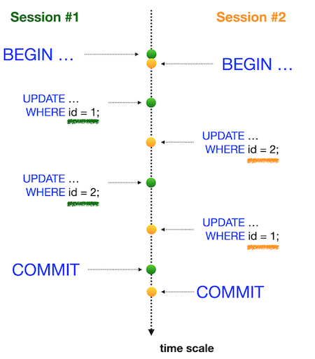

# Day 08 - Piscine SQL: Изоляция — одно из свойств ACID

## Обзор проекта

Этот день посвящен изучению работы транзакций и уровней изоляции в PostgreSQL. В рамках проекта исследуются различные аномалии параллельного доступа к данным и способы их предотвращения с помощью механизмов изоляции транзакций. Практические задания демонстрируют работу с уровнями изоляции `READ COMMITTED`, `REPEATABLE READ` и `SERIALIZABLE`.

---

## Теория: Изоляция транзакций и аномалии


### Основные концепции

* **ACID свойства** — набор требований к транзакциям:

  * Атомарность
  * Согласованность
  * Изоляция
  * Долговечность

* **Уровни изоляции** — настройки, определяющие степень видимости изменений между параллельными транзакциями

### Основные аномалии параллельного доступа

* **Потеря обновления (Lost Update)** — перезапись изменений одной транзакции другой
* **Грязное чтение (Dirty Read)** — чтение незафиксированных данных
* **Неповторяющееся чтение (Non-Repeatable Read)** — разные результаты при повторном чтении тех же данных
* **Фантомное чтение (Phantom Read)** — появление новых строк между повторными чтениями

---

## Матрица уровней изоляции ANSI SQL


Эта матрица показывает фундаментальный компромисс в работе СУБД:

* Аномалия предотвращается — ✅
* Аномалия возможна — ❌

**Read Committed** — базовый уровень, предотвращает только грязное чтение
**Repeatable Read** — гарантирует согласованность чтений
**Serializable** — полная изоляция, но низкая производительность

---

## Реализация в различных СУБД

### PostgreSQL
_Строго соответствует стандарту ANSI SQL_


### Oracle
_Уникальная реализация с фокусом на производительность_


### MySQL
_Специфическая реализация через блокировки_


---

## База данных

### Схема базы данных


**Описание таблиц** (сохранено из предыдущих дней):

* `pizzeria`
* `person`
* `menu`
* `person_visits`
* `person_order`

---

## Ключевые особенности

* 8 упражнений на работу с транзакциями и уровнями изоляции
* Практическое воспроизведение различных аномалий параллельного доступа
* Использование команд: `BEGIN`, `COMMIT`, `ROLLBACK`
* Настройка уровней изоляции с помощью `SET TRANSACTION ISOLATION LEVEL`
* Работа с параллельными сессиями в `psql`
* Важно: состояние базы данных сохраняется с предыдущих дней

---

## Задачи

### Exercise 00 - Простая транзакция
**Цель:** Демонстрация видимости изменений между транзакциями
**Файлы:** `day08_ex00.sql` + скриншоты двух сессий

### Шаги:

**Сессия #1**

```sql
BEGIN;
UPDATE pizzeria SET rating = 5 WHERE name = 'Pizza Hut';
SELECT * FROM pizzeria WHERE name = 'Pizza Hut'; -- Должно быть 5
```

**Сессия #2**

```sql
SELECT * FROM pizzeria WHERE name = 'Pizza Hut'; -- Всё ещё 4.6
```

**Сессия #1**

```sql
COMMIT;
```

**Сессия #2**

```sql
SELECT * FROM pizzeria WHERE name = 'Pizza Hut'; -- Теперь 5
```

### Ожидаемый результат:

До коммита:

```
 id |   name    | rating 
----+-----------+--------
  1 | Pizza Hut |   4.6
```

После коммита:

```
 id |   name    | rating 
----+-----------+--------
  1 | Pizza Hut |   5
```

---

### Exercise 01 - Аномалия потери обновления
* **Цель:** Воспроизвести потерю обновления при уровне изоляции `READ COMMITTED`
* **Файлы:** `day08_ex01.sql` + скриншоты
# 

### Предварительно:

```sql
SHOW TRANSACTION ISOLATION LEVEL; -- Должен быть "read committed"
```

### Шаги:

**Сессия #1**

```sql
BEGIN;
UPDATE pizzeria SET rating = 4 WHERE name = 'Pizza Hut';
```

**Сессия #2**

```sql
BEGIN;
UPDATE pizzeria SET rating = 3.6 WHERE name = 'Pizza Hut'; -- Ожидает
```

**Сессия #1**

```sql
COMMIT; -- Сессия #2 продолжает
```

**Сессия #2**

```sql
COMMIT; -- Перезаписывает изменение
```

### Результат:

Рейтинг `Pizza Hut` становится `3.6`. Изменение сессии #1 потеряно.

---

### Exercise 02 - Потеря обновления для Repeatable Read
* **Цель:** Продемонстрировать защиту от потери обновлений в `REPEATABLE READ`
* **Файлы:** `day08_ex02.sql` + скриншоты
# 

### Настройка:

```sql
SET TRANSACTION ISOLATION LEVEL REPEATABLE READ;
```

### Повторение шагов из Exercise 01

### Отличие:

Сессия #2 получит ошибку при `COMMIT`:

```
ERROR: could not serialize access due to concurrent update
```

### Результат:

Потеря обновления предотвращена. Вторая транзакция откатывается.

---

### Exercise 03 - Аномалия неповторяющегося чтения
* **Цель:** Воспроизвести проблему неповторяющегося чтения на `READ COMMITTED`
* **Файлы:** `day08_ex03.sql` + скриншоты
# 

### Шаги:

**Сессия #1**

```sql
BEGIN;
SELECT rating FROM pizzeria WHERE name = 'Pizza Hut'; -- Например, 4.6
```

**Сессия #2**

```sql
BEGIN;
UPDATE pizzeria SET rating = 3.6 WHERE name = 'Pizza Hut';
COMMIT;
```

**Сессия #1**

```sql
SELECT rating FROM pizzeria WHERE name = 'Pizza Hut'; -- Теперь 3.6
COMMIT;
```

### Результат:

Оба чтения в одной транзакции дают разные значения.

---

### Exercise 04 - Неповторяющееся чтение для Serialization
* **Цель:** Проверить защиту от неповторяющегося чтения в `SERIALIZABLE`
* **Файлы:** `day08_ex04.sql` + скриншоты
# 

### Настройка:

```sql
SET TRANSACTION ISOLATION LEVEL SERIALIZABLE;
```

### Повторение шагов из Exercise 03

### Отличие:

Оба чтения в Сессии #1 возвращают одно и то же значение (например, 4.6).

**Принцип работы:** PostgreSQL использует снимок данных на момент начала транзакции.

---

### Exercise 05 - Аномалия фантомного чтения
* **Цель:** Воспроизвести фантомные изменения в `READ COMMITTED`
* **Файлы:** `day08_ex05.sql` + скриншоты
# 

### Шаги:

**Сессия #1**

```sql
BEGIN;
SELECT SUM(rating) FROM pizzeria; -- Например, 21.9
```

**Сессия #2**

```sql
BEGIN;
UPDATE pizzeria SET rating = 1 WHERE name = 'Pizza Hut';
COMMIT;
```

**Сессия #1**

```sql
SELECT SUM(rating) FROM pizzeria; -- Например, 18.3
COMMIT;
```

### Результат:

Сумма меняется между двумя чтениями. Пример фантомного чтения.

---

### Exercise 06 - Фантомное чтение для Repeatable Read
* **Цель:** Проверить защиту от фантомного чтения в `REPEATABLE READ`
* **Файлы:** `day08_ex06.sql` + скриншоты
# 

### Настройка:

```sql
SET TRANSACTION ISOLATION LEVEL REPEATABLE READ;
```

### Повторение шагов из Exercise 05

### Отличие:

Сумма в Сессии #1 остаётся постоянной при повторном чтении.

---

### Exercise 07 - Взаимоблокировка (Deadlock)
* **Цель:** Воспроизвести ситуацию взаимоблокировки (Воспроизвести и понять `deadlock`)
* **Файлы:** `day08_ex07.sql` + скриншоты
# 

### Шаги:

**Сессия #1**

```sql
BEGIN;
UPDATE pizzeria SET rating = 5 WHERE name = 'Pizza Hut';
```

**Сессия #2**

```sql
BEGIN;
UPDATE pizzeria SET rating = 4 WHERE name = 'Dominos';
```

**Сессия #1**

```sql
UPDATE pizzeria SET rating = 3 WHERE name = 'Dominos'; -- Ожидание
```

**Сессия #2**

```sql
UPDATE pizzeria SET rating = 2 WHERE name = 'Pizza Hut'; -- DEADLOCK!
```

### Результат:

Одна из сессий завершится ошибкой:

```
ERROR: deadlock detected
```

---

## Общие требования ко всем упражнениям:

* Каждый сценарий оформляется в отдельном `.sql` файле: `day08_exNN.sql`
* В файле должны быть:

  * Комментарии, указывающие сессию (`-- Сессия #1`, `-- Сессия #2`)
  * Все SQL-команды в порядке, описанном в инструкции
* Скриншоты:

  * Вывод команд `psql` из каждой сессии
  * Видимость изменений или ошибок
* Важно соблюдать точную последовательность команд и уровни изоляции

---

## Технологии

* **PostgreSQL** — система управления реляционными базами данных
* **psql** — терминальный клиент PostgreSQL
* **Уровни изоляции:** `READ COMMITTED`, `REPEATABLE READ`, `SERIALIZABLE`

---

## Как использовать

1. Восстановите БД из [script](materials/model.sql)
2. Для каждого упражнения используйте два параллельных сеанса `psql`
3. Выполните SQL-команды из соответствующих файлов
4. Фиксируйте результаты скриншотами
5. Важно: сохраняйте порядок выполнения команд, как указано в заданиях
