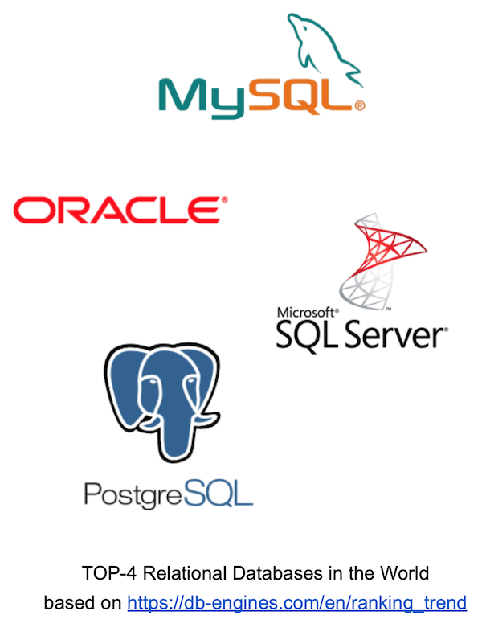

# Day 09 - Piscine SQL: RDBMS — это не только таблицы

## Обзор проекта

Этот день посвящен работе с функциональными блоками в базах данных. Вы научитесь создавать триггеры для аудита изменений, писать различные типы функций (SQL и PL/pgSQL) и оптимизировать бизнес-логику на уровне базы данных.

---

## Теория: Функциональные блоки в PostgreSQL



### Основные концепции:

* **Триггеры** — автоматически выполняемый код при событиях DML
* **Функции** — переиспользуемые блоки логики:

  * SQL-функции: простые запросы
  * PL/pgSQL: процедурные расширения
* **Аудит данных** — отслеживание изменений в таблицах

---

## Архитектурные подходы

|  |  | | |
| ------ | ------ | ------ | ------ |
|  | схема | Преимущества | Недостатки |
| **В приложении**  |  | Легче тестировать, языки общего назначения | Риск обхода логики при прямом доступе к |
| **В базе данных** |  | Гарантированное выполнение, высокая производительность | Сложнее отлаживать, привязка к СУБД |

---

## База данных

### Схема базы данных


**Таблицы** (сохранено из предыдущих дней):

* `pizzeria`
* `person`
* `menu`
* `person_visits`
* `person_order`

---

## Ключевые особенности

* 9 упражнений на различные аспекты функционального программирования в SQL
* Работа с триггерами для аудита данных
* Создание SQL и PL/pgSQL функций
* Параметризованные функции и функции-обертки
* Реализация алгоритмов средствами SQL
* **Важно**: состояние базы данных сохраняется с предыдущих дней

---

## Задачи

### Exercise 00 - Аудит вставляемых данных

**Файл**: `day09_ex00.sql`

#### Требуемые объекты:

* Таблица `person_audit` с полями:

  * `created` — временная метка (текущее время)
  * `type_event` — фиксированное значение `'I'` для INSERT
  * `row_id` — копия `id` из `person`
  * Остальные поля: дубликат `person` без ограничений
* Функция `fnc_trg_person_insert_audit`:

  * Сохраняет `NEW` в `person_audit`
  * Возвращает `NEW`
* Триггер `trg_person_insert_audit`:

  * AFTER INSERT
  * FOR EACH ROW

#### Тест:

```sql
INSERT INTO person(id, name, age, gender, address) 
VALUES (10,'Damir', 22, 'male', 'Irkutsk');
```

Ожидаемый результат — запись в `person_audit` с `type_event = 'I'`, `row_id = 10` и остальными данными.

---

### Exercise 01 - Аудит обновляемых данных

**Файл**: `day09_ex01.sql`

#### Требуемые объекты:

* Функция `fnc_trg_person_update_audit`:

  * Сохраняет `OLD` в `person_audit`
  * `type_event = 'U'`
* Триггер `trg_person_update_audit`:

  * AFTER UPDATE
  * FOR EACH ROW

#### Тест:

```sql
UPDATE person SET name = 'Bulat' WHERE id = 10;
UPDATE person SET name = 'Damir' WHERE id = 10;
```

Ожидаемый результат — две записи в `person_audit`, обе с `type_event = 'U'` и данными до изменения.

---

### Exercise 02 - Аудит удаляемых данных

**Файл**: `day09_ex02.sql`

#### Требуемые объекты:

* Функция `fnc_trg_person_delete_audit`:

  * Сохраняет `OLD` в `person_audit`
  * `type_event = 'D'`
* Триггер `trg_person_delete_audit`:

  * AFTER DELETE
  * FOR EACH ROW

#### Тест:

```sql
DELETE FROM person WHERE id = 10;
```

Ожидаемый результат — запись с `type_event = 'D'` и удалённой строкой.

---

### Exercise 03 - Универсальный аудит

**Файл**: `day09_ex03.sql`

#### Действия:

* Универсальная функция `fnc_trg_person_audit`:

  * `IF TG_OP = 'INSERT' THEN ...`
  * `ELSIF TG_OP = 'UPDATE' THEN ...`
  * `ELSIF TG_OP = 'DELETE' THEN ...`
* Универсальный триггер `trg_person_audit` на INSERT/UPDATE/DELETE
* Удалить старые триггеры и функции
* Очистить `person_audit`

#### Тест:

```sql
INSERT INTO person(id, name, age, gender, address) VALUES (10,'Damir', 22, 'male', 'Irkutsk');
UPDATE person SET name = 'Bulat' WHERE id = 10;
UPDATE person SET name = 'Damir' WHERE id = 10;
DELETE FROM person WHERE id = 10;
```

Ожидаемый результат — 4 записи в `person_audit` с типами `'I'`, `'U'`, `'U'`, `'D'`.

---

### Exercise 04 - Представления VS Функции

**Файл**: `day09_ex04.sql`

#### Требуемые функции:

* `fnc_persons_female()` — SQL-функция, возвращает `SETOF person`, где `gender = 'female'`
* `fnc_persons_male()` — аналогично, где `gender = 'male'`

#### Тест:

```sql
SELECT * FROM fnc_persons_female();
SELECT * FROM fnc_persons_male();
```

---

### Exercise 05 - Параметризованная функция

**Файл**: `day09_ex05.sql`

#### Действия:

* Удалить старые функции
* Создать `fnc_persons(pgender varchar DEFAULT 'female')`:

  * Возвращает `SETOF person`
  * Фильтр `gender = pgender`

#### Тест:

```sql
SELECT * FROM fnc_persons(pgender := 'male');
SELECT * FROM fnc_persons();
```

---

### Exercise 06 - Функция-обертка

**Файл**: `day09_ex06.sql`

#### Функция:

```sql
fnc_person_visits_and_eats_on_date(
  pperson varchar DEFAULT 'Dmitriy',
  pprice numeric DEFAULT 500,
  pdate date DEFAULT '2022-01-08'
) RETURNS TABLE (pizzeria_name varchar)
```

#### Логика:

* Человек был в пиццерии `pdate`
* Есть пицца дешевле `pprice`
* Вернуть имена пиццерий

#### Тест:

```sql
SELECT * FROM fnc_person_visits_and_eats_on_date(pprice := 800);
SELECT * FROM fnc_person_visits_and_eats_on_date(
  pperson := 'Anna', 
  pprice := 1300,
  pdate := '2022-01-01'
);
```

---

### Exercise 07 - Поиск минимума

**Файл**: `day09_ex07.sql`

#### Функция:

```sql
func_minimum(VARIADIC arr numeric[]) RETURNS numeric
```

* Возвращает минимум из переданного массива
* Работает с любыми числовыми типами

#### Тест:

```sql
SELECT func_minimum(VARIADIC arr => ARRAY[10.0, -1.0, 5.0, 4.4]);
-- Ожидаемый результат: -1.0
```

---

### Exercise 08 - Последовательность Фибоначчи

**Файл**: `day09_ex08.sql`

#### Функция:

```sql
fnc_fibonacci(pstop integer DEFAULT 10) RETURNS SETOF integer
```

* Начало: 0, 1
* Следующее = сумма двух предыдущих
* Возвращает все числа < pstop
* Используется цикл `WHILE`

#### Тест:

```sql
SELECT * FROM fnc_fibonacci(100);
-- 0,1,1,2,3,5,8,13,21,34,55,89

SELECT * FROM fnc_fibonacci();
-- 0,1,1,2,3,5,8
```

---

## Технологии

* **Триггеры** — автоматизация реакции на события
* **PL/pgSQL** — процедурное расширение SQL
* **Функции** — многократно используемые блоки кода
* **Аудит данных** — отслеживание изменений

---

## Как использовать

1. Восстановите БД из [script](materials/model.sql)
2. Для каждого упражнения создайте соответствующий `.sql`-файл
3. Каждый файл должен содержать:

   * SQL-команды
   * Комментарии с пояснениями
4. Проверьте работу решений:

   * Триггеры на тестовых данных
   * Функции с различными параметрами
5. Сохраните файлы в соответствующих директориях (`ex00`–`ex08`)

**Важно**: Убедитесь, что решения работают последовательно и не конфликтуют между собой.
