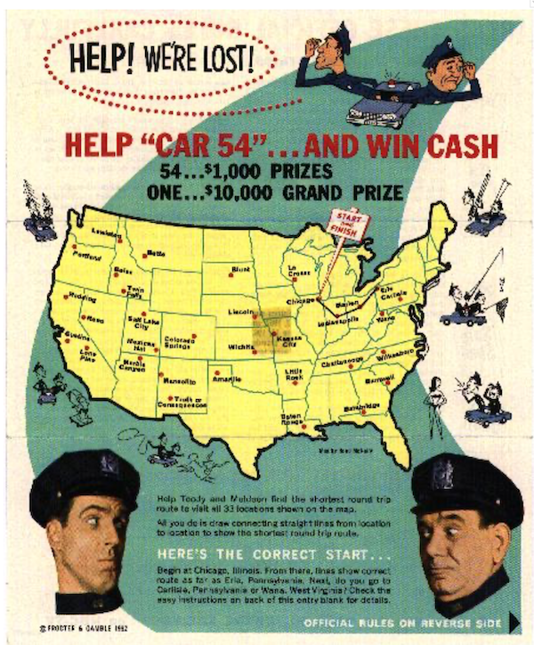

# Day 08 - Piscine SQL: Traveling Salesman Problem

## Обзор проекта

Этот день посвящен решению классической задачи коммивояжера (TSP) с использованием SQL. В рамках проекта реализованы 2 практических решения, демонстрирующих применение рекурсивных запросов для решения сложных оптимизационных проблем на графах.

---

## Теория: Задача коммивояжера



### Основные концепции:
- **TSP (Traveling Salesman Problem)** — NP-трудная задача оптимизации  
- **Цель:** найти самый дешевый маршрут, проходящий через все города ровно один раз с возвратом в начальную точку  
- **Сложность:** факториальный рост количества возможных маршрутов с увеличением городов

### Историческая справка:
- **1920-е**: впервые сформулирована Карлом Менгером в Вене  
- **1930-е**: получила распространение в математических кругах Принстона  
- **1940-е**: применялась в сельскохозяйственной статистике (Махаланобис, Джессен)  
- **1962**: знаменитый конкурс Proctor and Gamble с 33 городами

---

## База данных

### Схема данных:


### Описание таблицы `travel_routes`:

```sql
CREATE TABLE travel_routes (
    point1 VARCHAR NOT NULL,
    point2 VARCHAR NOT NULL,
    cost INTEGER NOT NULL
);
```

### Особенности структуры:
- **Симметричные пути:** (A→B) = (B→A)  
- **Полный граф:** соединены все вершины  
- **Хранит стоимость перемещения между городами**

#### Пример данных:

| point1 | point2 | cost |
|--------|--------|------|
| a      | b      | 10   |
| b      | a      | 10   |
| ...    | ...    | ...  |

---

## Ключевые особенности

- 2 упражнения на решение задачи коммивояжера  
- Использование рекурсивных SQL-запросов  
- Поиск **оптимальных** и **наихудших** маршрутов  
- Работа с путями в графе  
- Генерация всех возможных перестановок  
- Фильтрация **полных циклов** (гамильтоновых циклов)

---

## Задачи

### Exercise 00 — Classical TSP

#### Задание:
Найти все туры с **минимальной стоимостью**, начинающиеся из города `"a"`.  
Тур должен включать **все города** и возвращаться в **исходную точку**.

#### Требования:
- Использовать **рекурсивный запрос**
- Вернуть столбцы: `total_cost` (общая стоимость), `tour` (маршрут)
- Отсортировать по `total_cost` (возрастание), затем по `tour` (возрастание)

#### Пример вывода:

| total_cost | tour          |
|------------|---------------|
| 80         | {a,b,d,c,a}   |
| ...        | ...           |

---

### Exercise 01 — Opposite TSP

#### Задание:
Расширить решение Exercise 00, добавив туры с **максимальной стоимостью**.

#### Требования:
- Использовать **модифицированный рекурсивный запрос**
- Вывести те же столбцы: `total_cost`, `tour`
- Отсортировать по `total_cost` (возрастание), затем по `tour` (возрастание)

#### Пример вывода:

| total_cost | tour          |
|------------|---------------|
| 80         | {a,b,d,c,a}   |
| ...        | ...           |
| 95         | {a,d,c,b,a}   |

---

## Технологии

- **PostgreSQL** — система управления реляционными базами данных  
- **ANSI SQL** — стандартизированный язык запросов  
- **Рекурсивные CTE** — ключевая технология для работы с графами  
- **psql / pgAdmin** — инструменты для работы с PostgreSQL

---

## Как использовать

1. Создайте таблицу `travel_routes` с помощью DDL из задания  
2. Заполните таблицу тестовыми данными (4 города как на схеме)  
3. Для каждого упражнения выполните соответствующий SQL-файл:
   - `team00_ex00.sql` для Exercise 00  
   - `team00_ex01.sql` для Exercise 01  
4. Проверьте результаты выполнения запросов

**Важно:**  
Упражнения должны выполняться **последовательно**. Exercise 01 является расширением Exercise 00.

---

## Исторический контекст


Решение TSP для 33 городов (Proctor & Gamble, 1962)

Задача коммивояжера остается одной из самых известных **NP-трудных проблем** в информатике. Несмотря на простую формулировку, для больших наборов данных (N > 20) **не существует эффективного точного решения**. Представленные в проекте решения демонстрируют **мощь SQL** для работы с рекурсивными структурами данных и решения сложных комбинаторных задач.
