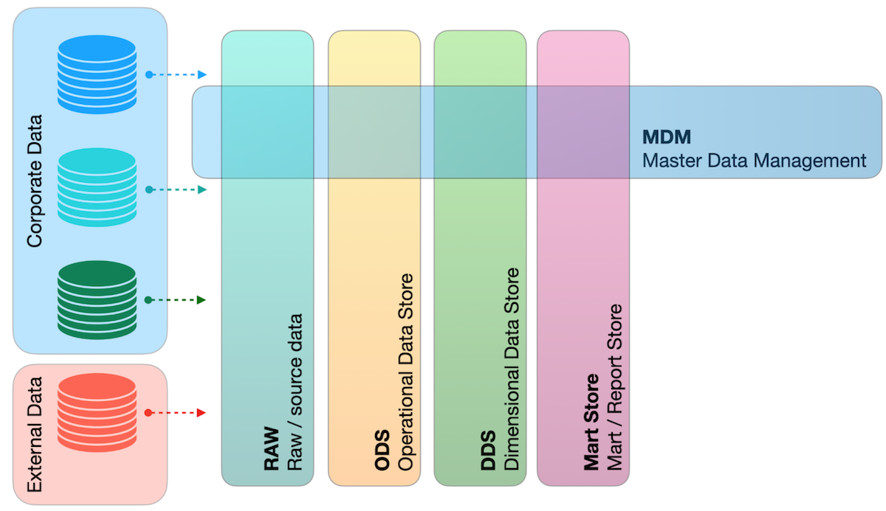

# Team 01 - Piscine SQL: Data Warehouse Fundamentals

## Обзор проекта

Этот день посвящен основам построения хранилищ данных (DWH) и созданию ETL-процессов. В рамках проекта решены 2 практические задачи, демонстрирующие работу с разнородными источниками данных и обработку временных данных в контексте DWH.

---

## Теория: Хранилища данных и LakeHouse


### Основные концепции:

**DWH (Data Warehouse)** — централизованное хранилище для анализа бизнес-данных.

### Два подхода к проектированию:

* **Билла Инмона:**
  *"Хранилище данных — это предметно-ориентированная, интегрированная, неизменяемая, зависящая от времени коллекция данных"*

* **Ральфа Кимбалла:**
  *"Система извлечения, очистки, преобразования и загрузки данных в хранилище измерений"*

| Подход Инмона                      | Подход Кимбалла                    |
| ---------------------------------- | ---------------------------------- |
|  |  |

---

### Современные тенденции:

**LakeHouse** — современный подход, объединяющий Data Lake и Data Warehouse.

---

### Логические уровни данных:

* Источники данных (OLTP-системы)
* ODS (Operational Data Store)
* DWH (Data Warehouse)
* Витрины данных (Data Marts)



---

### Модели данных:

* Реляционная модель
* Временная модель
* Звезда/Снежинка
* Галактика
* Data Vault
* Графовая модель

---

## База данных

### Схема данных


---

### Описание таблиц

#### Источники данных (OLTP-системы):

**Green Source (Пользователи):**

```sql
CREATE TABLE "user" (
    id INTEGER PRIMARY KEY,
    name VARCHAR(50),
    lastname VARCHAR(50)
);
```

**Red Source (Валюты):**

```sql
CREATE TABLE currency (
    id INTEGER PRIMARY KEY,
    name VARCHAR(50),
    rate_to_usd NUMERIC
);
```

**Blue Source (Балансы):**

```sql
CREATE TABLE balance (
    user_id INTEGER,
    money NUMERIC,
    type INTEGER,
    currency_id INTEGER
);
```

---

#### Хранилище данных (DWH):

**Таблица пользователей:**

```sql
CREATE TABLE "user" (
    id INTEGER PRIMARY KEY,
    name VARCHAR(50),
    lastname VARCHAR(50)
);
```

**Таблица валют (с временными метками):**

```sql
CREATE TABLE currency (
    id INTEGER,
    name VARCHAR(50),
    rate_to_usd NUMERIC,
    updated TIMESTAMP
);
```

**Таблица балансов (с временными метками):**

```sql
CREATE TABLE balance (
    user_id INTEGER,
    money NUMERIC,
    type INTEGER,
    currency_id INTEGER,
    updated TIMESTAMP
);
```

---

## Проблемы данных

* Отсутствие согласованности между источниками
* Возможные NULL-значения
* OLTP-системы не хранят историю изменений
* Отсутствие явных внешних ключей ("виртуальные" связи)

---

## Ключевые особенности

* 2 упражнения на работу с разнородными источниками данных
* Обработка временных данных (temporal data)
* Работа с аномалиями данных (отсутствующие связи, NULL-значения)
* Использование оконных функций для получения последних значений
* Конвертация валют с учетом исторических курсов
* Агрегация данных с группировкой

---

## Задачи

### Exercise 00 — Classical DWH

**Задание:**
Рассчитать общий объем транзакций по пользователям и типам баланса с конвертацией в USD по последнему курсу.

**Требования:**

* Обработать все данные, включая аномальные
* Заменить NULL на `'not defined'` для имен и валют
* Использовать последний доступный курс валюты
* Рассчитать `total_volume_in_usd = volume * last_rate_to_usd`
* Отсортировать по имени (убывание), фамилии и типу баланса (возрастание)

**Пример вывода:**

| name | lastname    | type | volume | currency\_name | last\_rate\_to\_usd | total\_volume\_in\_usd |
| ---- | ----------- | ---- | ------ | -------------- | ------------------- | ---------------------- |
| Петр | not defined | 2    | 203    | not defined    | 1                   | 203                    |
| Иван | Иванов      | 1    | 410    | EUR            | 0.9                 | 369                    |

---

### Exercise 01 — Detailed Query

**Задание:**
Для каждой транзакции баланса рассчитать сумму в USD с использованием ближайшего курса валюты во времени.

**Требования:**

* Выполнить дополнительные `INSERT` в таблицу `currency`
* Найти ближайший курс в прошлом или будущем
* Рассчитать `currency_in_usd = money * rate_to_usd`
* Отсортировать по имени (убывание), фамилии и названию валюты (возрастание)

**Пример вывода:**

| name | lastname | currency\_name | currency\_in\_usd |
| ---- | -------- | -------------- | ----------------- |
| Иван | Иванов   | EUR            | 150.1             |
| Иван | Иванов   | EUR            | 17                |


---

## Технологии

* **PostgreSQL** — система управления реляционными базами данных
* **ANSI SQL** — стандартизированный язык запросов
* **Оконные функции** — для работы с временными рядами
* **ETL-процессы** — извлечение, преобразование, загрузка данных

---

## Как использовать

1. Загрузите и выполните [script](materials/rush01_model.sql) для создания структуры БД.

2. Для Exercise 01 выполните дополнительные `INSERT`:

```sql
INSERT INTO currency VALUES (100, 'EUR', 0.85, '2022-01-01 13:29');
INSERT INTO currency VALUES (100, 'EUR', 0.79, '2022-01-08 13:29');
```

3. Для каждого упражнения выполните соответствующий SQL-файл:

* `team01_ex00.sql` для Exercise 00
* `team01_ex01.sql` для Exercise 01

4. Проверьте результаты выполнения запросов.

**Важно:**
Упражнения должны выполняться последовательно. Exercise 01 использует данные, добавленные в Exercise 00.
